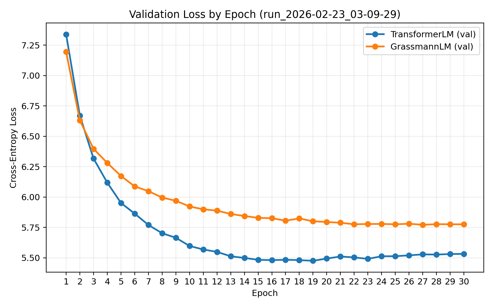
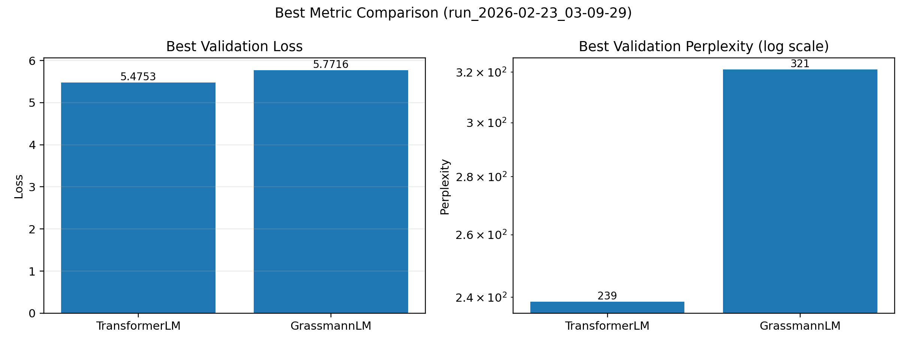

# Grassmann Flows vs Transformer (Paper Reproduction)

This repository reproduces and tests the ideas from:

**Attention Is Not What You Need: Grassmann Flows as an Attention-Free Alternative for Sequence Modeling**  
arXiv: `2512.19428`

The goal is simple: implement the paper-aligned Grassmann block, run the same training setup as the 6-layer / context-128 setting, and compare directly against a size-matched Transformer baseline.

## Why This Project

Attention is powerful, but expensive.  
The paper proposes an attention-free sequence mixing approach based on Grassmann flows.  
This project evaluates whether that approach works in practice under controlled, matched conditions.

## What Was Implemented

- Paper-aligned Grassmann gate mixing:
  - `h_mix = alpha * h + (1 - alpha) * g`
  - `alpha = sigmoid(W_gate[h; g] + b_gate)`
- Paper-aligned post-norm flow for the Grassmann block.
- Baseline Transformer and Grassmann models with matched core dimensions.
- UV + Hydra experiment pipeline for reproducible multirun comparisons.
- Official local WikiText-2 parquet loading (`wikitext-2-raw-v1`).

## Experiment Configuration (Final Run)

- Run tag: `2026-02-23_03-09-29`
- Models: `attention`, `grassmann`
- Dataset: full WikiText-2 (`Salesforce/wikitext`, `wikitext-2-raw-v1`)
- Sequence length: `128`
- Layers: `6`
- Batch size: `32`
- Epochs: `30`
- Lags: `{1,2,4,8,12,16}`
- Device: CUDA (`RTX 3060 Ti`)
- DataLoader workers: `2`

Command used:

```bash
PYTHONUNBUFFERED=1 UV_CACHE_DIR=/tmp/uv-cache UV_PYTHON_INSTALL_DIR=/tmp/uv-python \
uv run --python /home/xncb135/miniconda3/bin/python3 \
python -u train_hydra.py -m model=attention,grassmann \
  train.num_epochs=30 \
  train.batch_size=32 \
  train.num_workers=2 \
  data.max_samples_train=null \
  data.max_samples_val=null
```

## Final Results (Run: 2026-02-23_03-09-29)

| Model | Params (M) | Best Val Loss | Best Val PPL |
|---|---:|---:|---:|
| TransformerLM | 12.59 | 5.4753 | 238.71 |
| GrassmannLM | 12.61 | 5.7716 | 321.05 |

## Visualizations

### Validation loss over epochs



### Best validation metrics



## Interpretation

- In this full-data 30-epoch run, **Transformer outperformed Grassmann**.
- Relative to Transformer:
  - Grassmann best val loss is higher by about **5.41%**
  - Grassmann best val perplexity is higher by about **34.49%**
- Attention result (`238.71`) is in the same range as the paper-reported attention number (mid-200s), suggesting the baseline training setup is reasonable.
- Grassmann underperforms in this reproduction run, so the current implementation/configuration does not replicate a Grassmann advantage here.

## Reproduce

```bash
uv sync

# Run both models
uv run python train_hydra.py -m model=attention,grassmann \
  train.num_epochs=30 train.batch_size=32 train.num_workers=2 \
  data.max_samples_train=null data.max_samples_val=null

# Build comparison table for this run
uv run python summarize_results.py \
  --root training_results_hydra/multirun/2026-02-23/03-09-29 \
  --out training_results_hydra/comparison_table_2026-02-23_03-09-29.md

# Plot figures for this run
uv run python plot_hydra_results.py \
  --results training_results_hydra/multirun/2026-02-23/03-09-29/0_attention/results.json \
            training_results_hydra/multirun/2026-02-23/03-09-29/1_grassmann/results.json \
  --tag run_2026-02-23_03-09-29
```
