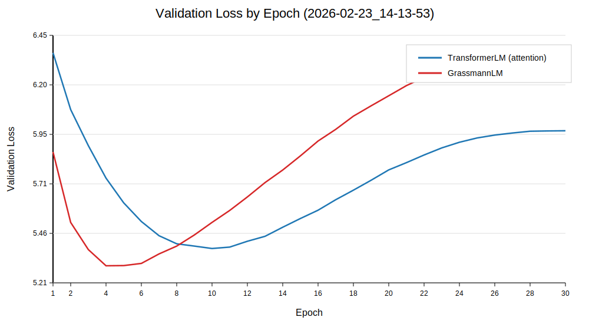
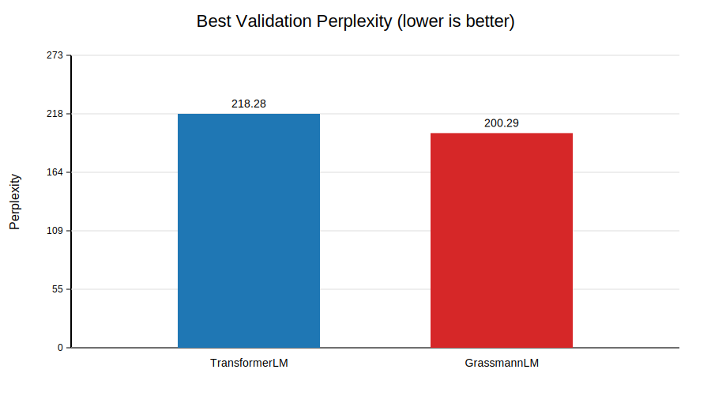

# Grassmann Flows vs Transformer (Paper-Style Reproduction)

This project reproduces and stress-tests the language modeling setup from:

**Attention Is Not What You Need: Grassmann Flows as an Attention-Free Alternative for Sequence Modeling** (arXiv: `2512.19428`)

The goal is to implement the Grassmann block at code level, run matched experiments against a Transformer baseline, and report results with transparent training curves and interpretation.

## Why This Project

The paper claims that an attention-free Grassmann mixer can stay competitive with Transformer self-attention on WikiText-2.
This repository exists to verify that claim under controlled, reproducible conditions and understand where behavior diverges.

## What Was Implemented

- Decoder-only LM backbone with matched dimensions for both mixers.
- Paper-style Grassmann gate mixing:
  - `h_mix = alpha * h + (1 - alpha) * g`
  - `alpha = sigmoid(W_gate [h; g] + b_gate)`
- Layerwise lag schedule support for 12-layer depth pattern:
  - `(1,1,2,2,4,4,8,8,12,12,16,16)`
- Causal Grassmann pairing (`t` with `t-lag`) to avoid future-token leakage.
- Training stability fixes used in final run:
  - small-std LM initialization (`N(0, 0.02)` for Linear/Embedding)
  - pre-norm training (`model.pre_norm=true`)
  - pre-norm residual path for Grassmann mixing
  - AMP scheduler-step guard (step only after real optimizer step)
- Hydra-based experiment management with fully logged `results.json` outputs.

## Final Reproduction Run (Table-2 Style)

- Run tag: `2026-02-23/14-13-53`
- Dataset: WikiText-2 raw (`wikitext-2-raw-v1`)
- Tokenizer: `bert-base-uncased` (`~30,522` vocab)
- Block size: `256`
- Layers: `12`
- Model dim / FFN dim: `256 / 1024`
- Heads: `4`
- Batch size: `16`
- Epochs: `30`
- Learning rate: `1e-3` (AdamW + cosine)
- Device: CUDA

## Results

### Direct model comparison (best validation over 30 epochs)

| Model | Params (M) | Best Val Loss | Best Val PPL |
|---|---:|---:|---:|
| TransformerLM (attention) | 17.36 | 5.3858 | 218.28 |
| GrassmannLM | 17.40 | 5.2997 | 200.29 |

### Against paper Table 2 values

| Model | Paper Val PPL | This Reproduction Val PPL | Delta vs Paper |
|---|---:|---:|---:|
| TransformerLM | 235.2 | 218.28 | -7.19% |
| GrassmannLM | 261.1 | 200.29 | -23.29% |

Relative model gap in this run:

- Grassmann vs Transformer (PPL): **-8.24%** (Grassmann lower/better)

### Strict paper-like run (no stabilization switches)

To verify strict reproducibility, we also ran the same 12-layer/256/30 setup with:

- `model.pre_norm=false`
- `model.use_custom_init=false`
- all other core settings matched

Run tag: `2026-02-27/20-23-53`

| Model | Best Val PPL (Strict) |
|---|---:|
| TransformerLM (attention) | 1381.35 |
| GrassmannLM | 290.60 |

This strict run does **not** reproduce Table 2-level performance.

## Visual Graphs

### Validation loss curves



### Best validation perplexity comparison



## Interpretation

- Both models improve sharply early, then overfit in later epochs; best checkpoints occur early (attention around epoch 10, Grassmann around epoch 4).
- In this stabilized 12-layer setup, **Grassmann outperforms Transformer** on validation perplexity.
- This is **not the same ordering** as paper Table 2 (paper reports Transformer better), so exact ranking reproduction is not achieved even though both models are in the same performance regime (low-200s PPL).
- The ordering flip strongly suggests sensitivity to optimization/normalization details at this scale.

### Why strict reproduction fails here

The failure is driven by optimization stability at depth 12:

- With strict defaults (`pre_norm=false`, no small-std init), the initial logits/loss scale is extremely large (e.g., attention init loss `~120`, logits abs max `~168`), which causes unstable training dynamics.
- Enabling small-std initialization (`N(0, 0.02)`) collapses initial scale to a normal range (init loss `~10`, logits abs max `~4`).
- `pre_norm=true` further improves early-step behavior at 12 layers.

In short: strict configuration in this implementation/environment is numerically unstable for attention, and that instability dominates the final mismatch.

## Reproduce

```bash
# install env (if network/cache available)
uv sync

# final Table-2 style run
uv run python train_hydra.py -m model=attention,grassmann \
  model.num_layers=12 \
  model.pre_norm=true \
  data.max_context_len=256 \
  train.batch_size=16 \
  model.layerwise_lags=true \
  model.lags='[1,1,2,2,4,4,8,8,12,12,16,16]' \
  train.num_epochs=30 \
  train.learning_rate=0.001 \
  train.num_workers=0 \
  data.max_samples_train=null \
  data.max_samples_val=null
```

Key result files:

- `training_results_hydra/multirun/2026-02-23/14-13-53/0_attention/results.json`
- `training_results_hydra/multirun/2026-02-23/14-13-53/1_grassmann/results.json`
- `training_results_hydra/multirun/2026-02-27/20-23-53/0_attention/results.json` (strict)
- `training_results_hydra/multirun/2026-02-27/20-23-53/1_grassmann/results.json` (strict)
