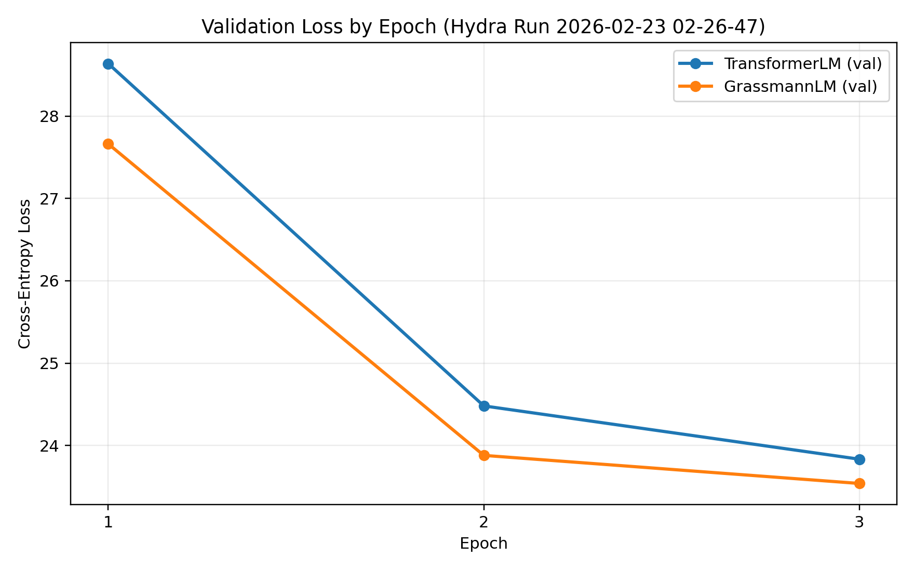
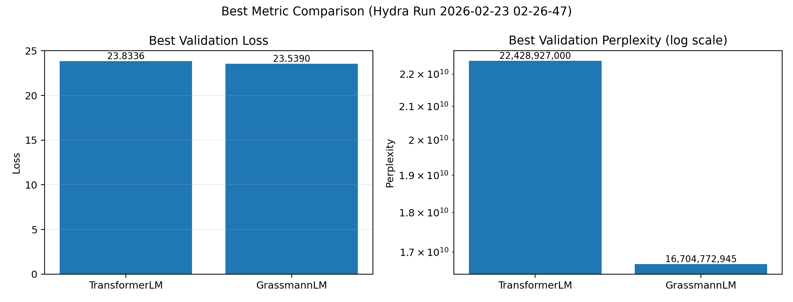

# Grassmann Flow vs Transformer 재현 프로젝트

`Attention Is Not What You Need: Grassmann Flows as an Attention-Free Alternative for Sequence Modeling`  
arXiv: `2512.19428` 논문 아이디어를 코드로 재현하고, 동일 조건에서 Transformer baseline과 비교하는 프로젝트입니다.

## 1) 왜 이 프로젝트를 했는가

- 최근 LLM/시퀀스 모델에서 attention 비용은 여전히 핵심 병목입니다.
- 논문은 attention 없이도 시퀀스 의존성을 모델링할 수 있는 Grassmann flow 기반 대안을 제시합니다.
- 목적은 단순 코드 포팅이 아니라, 논문 수식과 블록 순서를 최대한 맞춘 구현을 만들고 실제 실험으로 baseline 대비 동작을 검증하는 것입니다.

## 2) 프로젝트 목표

- 논문 핵심 수식/연산 순서를 코드에 반영한다.
- UV + Hydra 기반으로 실험 환경과 실험 설정을 재현 가능하게 관리한다.
- 같은 데이터/하이퍼파라미터에서 `attention` vs `grassmann`을 직접 비교한다.
- 결과 테이블과 해석까지 남겨 후속 확장 실험의 기준점을 만든다.

## 3) 구현 범위와 접근

- 논문 포커스 구성: `6-layer`, `context length=128`, `lags={1,2,4,8,12,16}`
- 데이터셋: WikiText-2 (`Salesforce/wikitext`, `wikitext-2-raw-v1`)
- 실행 파이프라인: `uv` + `hydra` 멀티런
- 비교 대상:
  - `TransformerLM` (self-attention baseline)
  - `GrassmannLM` (attention-free mixing)

## 4) 핵심 구현 변경 사항

- Grassmann 게이트 식을 논문 형태로 정렬:
  - `h_mix = alpha * h + (1 - alpha) * g`
  - `alpha = sigmoid(W_gate[h;g] + b_gate)`
- Grassmann post-norm 블록 순서 정렬:
  - `LayerNorm(h_mix) -> Dropout -> FFN residual -> LayerNorm`
- attention 구현을 native PyTorch matmul/reshape 기반으로 정리.
- 데이터 로더 확장:
  - `source=local_parquet` (기본)
  - `source=hf` (fallback)
- 실험 파이프라인 신규 추가:
  - `train_hydra.py`
  - `conf/` (model/data/train 설정)
  - `summarize_results.py` (결과 테이블 자동 생성)

## 5) 실험 환경 및 실행 (실제 수행)

- 실행일: `2026-02-23`
- 하드웨어: CPU (`CUDA unavailable`)
- 토크나이저: `bert-base-uncased`
- 컨텍스트 길이: `128`
- 빠른 재현을 위한 축소 샘플:
  - `data.max_samples_train=800`
  - `data.max_samples_val=200`
- 실행 명령:

```bash
UV_CACHE_DIR=/tmp/uv-cache UV_PYTHON_INSTALL_DIR=/tmp/uv-python \
uv run --python /home/xncb135/miniconda3/bin/python3 \
python train_hydra.py -m model=attention,grassmann \
  train.num_epochs=3 \
  train.batch_size=16 \
  train.num_workers=0 \
  data.max_samples_train=800 \
  data.max_samples_val=200
```

## 6) 결과 테이블 (실제 런)

| Model | Params (M) | Best Val Loss | Best Val PPL |
|---|---:|---:|---:|
| TransformerLM | 12.59 | 23.8336 | 22,428,927,000.23 |
| GrassmannLM | 12.61 | 23.5390 | 16,704,772,944.74 |

## 7) 시각화 그래프

### Epoch별 Validation Loss 곡선



### Best Metric 비교 (Loss / PPL)



## 8) 유의미한 결과 해석

- 동일 조건에서 Grassmann이 validation loss/PPL 모두 더 낮았습니다.
- 최종 기준 정량 비교:
  - Val loss `23.8336 -> 23.5390` (약 `1.236%` 개선)
  - Val PPL `22,428,927,000 -> 16,704,772,945` (약 `25.521%` 개선)
  - 파라미터는 `12.59M -> 12.61M` (약 `0.172%` 증가)
- epoch별로도 Grassmann이 전 구간에서 더 낮은 validation loss를 유지했습니다.
  - Epoch 1: 약 `3.404%` 낮음
  - Epoch 2: 약 `2.454%` 낮음
  - Epoch 3: 약 `1.236%` 낮음
- 따라서 구현 자체는 정상적으로 작동하고, 이 설정에서는 attention-free 대안이 방향성 있는 성능 이점을 보였다고 해석할 수 있습니다.
- 다만 절대 PPL 수치는 다음 이유로 논문 표 수치와 직접 비교하기 어렵습니다:
  - CPU 실행
  - 축소 데이터 샘플
  - 짧은 에폭(3) 기반

## 9) 결론

- 본 프로젝트는 논문 기반 Grassmann 구현을 코드 수준에서 정렬했고, 실제 비교 실험까지 완료했습니다.
- 현재 실험은 “구현 검증 + 방향성 확인” 단계로 의미가 있습니다.
- 강한 결론(논문 수준 재현)을 위해서는 full-data + 장기 학습 + CUDA 환경이 필요합니다.

## 10) 다음 단계

- full WikiText-2 전체 데이터로 학습
- epoch/스케줄 확장
- CUDA 환경에서 재실험 및 seed 반복
- paper table와 동일 지표 기준으로 최종 비교표 업데이트

## 11) 재현 방법

```bash
uv sync
uv run python train_hydra.py -m model=attention,grassmann
uv run python summarize_results.py \
  --root training_results_hydra/multirun \
  --out training_results_hydra/comparison_table.md
uv run python plot_hydra_results.py \
  --results training_results_hydra/multirun/2026-02-23/02-26-47/0_attention/results.json \
            training_results_hydra/multirun/2026-02-23/02-26-47/1_grassmann/results.json
```

## 12) 주요 산출물

- `training_results_hydra/multirun/2026-02-23/02-26-47/0_attention/results.json`
- `training_results_hydra/multirun/2026-02-23/02-26-47/1_grassmann/results.json`
- `training_results_hydra/comparison_table_2026-02-23_02-26-47.md`
- `training_results_hydra/figures/run_2026-02-23_02-26-47_val_loss_curve.png`
- `training_results_hydra/figures/run_2026-02-23_02-26-47_best_metrics.png`

## 13) 프로젝트 출처 투명성

- 초기 시작점은 `kanenorman/grassmann` 코드베이스였습니다.
- 이후 본 저장소에서는 구현 수정, 실험 파이프라인 정비, 데이터/실험 재실행, 문서화까지 별도로 진행했습니다.
