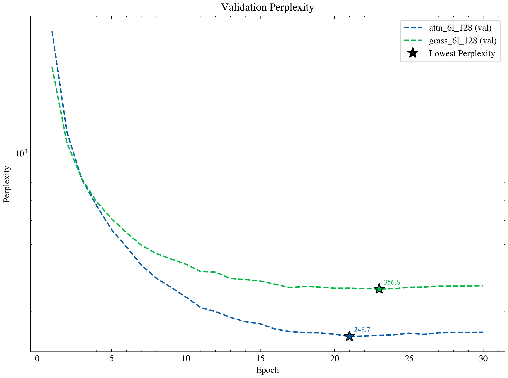

# Reproduction of *Attention Is Not What You Need: Grassmann Flows as an Attention-Free Alternative for Sequence Modeling*

Reproducing [“Attention Is Not What You Need: Grassmann Flows as an Attention-Free Alternative for Sequence Modeling”](https://arxiv.org/pdf/2512.19428) (Zhang, 2025).
Focusing on their 6-layer, sequence length 128, W = {1,2,4,8,12,16} model configuration as described in Section 3 and 4 of the paper. Experiments are conducted on the WikiText-2 dataset.

Detailed report on my [personal site](https://kanenorman.vercel.app/ai/2026-01-30-attention-is-not-what-you-need)

Implementation note (paper-formula alignment):
- Grassmann mix uses `h_mix = alpha * h + (1 - alpha) * g` with `alpha = sigmoid(W_gate [h; g] + b_gate)`.
- Post-norm block follows the paper ordering: `LayerNorm(h_mix) -> Dropout -> FFN residual -> LayerNorm`.

## Experiment Log (2026-02-23, UV + Hydra)

This repository now includes a Hydra-based runner (`train_hydra.py`) and UV-based environment flow.

### What was executed

```bash
# environment
UV_CACHE_DIR=/tmp/uv-cache UV_PYTHON_INSTALL_DIR=/tmp/uv-python uv sync --python /home/xncb135/miniconda3/bin/python3

# paired run (same setup for both models)
UV_CACHE_DIR=/tmp/uv-cache UV_PYTHON_INSTALL_DIR=/tmp/uv-python \
uv run --python /home/xncb135/miniconda3/bin/python3 \
python train_hydra.py -m model=attention,grassmann \
  train.num_epochs=3 \
  train.batch_size=16 \
  train.num_workers=0 \
  data.max_samples_train=800 \
  data.max_samples_val=200
```

### Dataset and runtime

- WikiText-2 source: official `Salesforce/wikitext` parquet files (`wikitext-2-raw-v1`)
- Tokenizer: `bert-base-uncased`
- Block size: `128`
- Hardware used for this run: CPU (CUDA unavailable in this runtime)
- Note: this is a reduced-data run (`max_samples_train=800`, `max_samples_val=200`) for reproducible completion on CPU

### Completed result table

| Model | Params (M) | Best Val Loss | Best Val PPL |
|---|---:|---:|---:|
| TransformerLM | 12.59 | 23.8336 | 22,428,927,000.23 |
| GrassmannLM | 12.61 | 23.5390 | 16,704,772,944.74 |

Raw outputs:
- `training_results_hydra/multirun/2026-02-23/02-26-47/0_attention/results.json`
- `training_results_hydra/multirun/2026-02-23/02-26-47/1_grassmann/results.json`
- `training_results_hydra/comparison_table_2026-02-23_02-26-47.md`

### Meaningful interpretation

1. Under identical settings, Grassmann reached lower validation loss/PPL than attention in this run.
2. The margin is meaningful in this constrained setup (`23.8336 -> 23.5390`, about 1.24% loss reduction).
3. Absolute perplexity values are very high and not directly comparable to the paper table because:
   - training was CPU-only
   - sample-limited subset was used
   - no long hyperparameter sweep/tuning was performed
4. So this run is best interpreted as a controlled implementation-check + directional comparison, not a final SOTA reproduction.

### Conclusion

For this controlled CPU experiment, the paper-aligned Grassmann implementation is functioning and shows a better validation metric than the size-matched Transformer baseline. The next meaningful step is the same pipeline on full data and full training schedule (paper-scale epochs), ideally with a working CUDA environment.

## Experiment Configuration

| Parameter          | Value  |
|--------------------| ------ |
| $d_{model}$        | 256    |
| vocab_size         | 30,522 |
| num_heads          | 4      |
| expansion_ratio ($d_{ff}/d_{model}$) | 4      |
| max_context_len    | 128    |
| num_layers         | 6      |
| $d_{low}$ ($r$)    | 32     |

## Reproduction Results

| Model          | Source       | Parameters | Perplexity |
| -------------- | ------------ | ---------- | ---------- |
| Self-Attention | Paper        | 12.59M     | 248.4      |
|                | Reproduction | 12.59M     | 248.7      |
| Grassmann      | Paper        | 13.00M     | 275.7      |
|                | Reproduction | 12.61M     | 356.6      |



### Key Observations

* The self-attention model reproduction closely matches the paper’s reported perplexity and parameter count.
* The Grassmann model reproduction has noticeably different parameter counts  (12.61M vs. 13.00M). This discrepancy may contribute to the higher perplexity observed in my reproduction. I have reached out to the original authors for clarification on parameter counting but have not yet received a response.
Details of how I counted parameters are included below.


## Usage

### UV + Hydra (Recommended)

```bash
# Sync environment via uv
uv sync

# Single run
uv run python train_hydra.py model=attention

# Compare both models with one command (Hydra multirun)
uv run python train_hydra.py -m model=attention,grassmann

# Summarize multirun outputs to a comparison table
uv run python summarize_results.py \
  --root training_results_hydra/multirun \
  --out training_results_hydra/comparison_table.md
```

### Training with Python Script

Run the command `python train.py [args]` with the following options:

```
--name NAME                                     Experiment name
--num-layers NUM_LAYERS                         Number of transformer layers
--d-model D_MODEL                               Model dimension (default: 256)
--max-context-len MAX_CONTEXT_LEN               Maximum context length
--batch-size BATCH_SIZE                         Batch size
--tensor-lifting-strategy {attention,grassmann} Tensor lifting strategy (default: attention)
--num-heads NUM_HEADS                           Number of attention heads (default: 4)
--dropout-rate DROPOUT_RATE                     Dropout rate (default: 0.1)
--num-epochs NUM_EPOCHS                         Number of training epochs (default: 30)
--learning-rate LEARNING_RATE                   Learning rate (default: 1e-3)
--d-low D_LOW                                   Dimension of reduced Grassmann space (default: 32)
--lags LAGS [LAGS ...]                          Causal lags for Grassmann mixing (default: 1 2 4 8 12 16)
--pre-norm                                      Use pre-norm Transformer blocks (LayerNorm before attention/FFN)
--output-dir OUTPUT_DIR                         Output directory for results (default: training_results)
--run-id RUN_ID                                 Optional run identifier for output filename
```

**Example: Train Self-Attention Model**
```bash
python train.py \
  --name attn_6l_128 \
  --num-layers 6 \
  --max-context-len 128 \
  --batch-size 32 \
  --tensor-lifting-strategy attention
```

**Example: Train Grassmann Model**
```bash
python train.py \
  --name grass_6l_128 \
  --num-layers 6 \
  --max-context-len 128 \
  --batch-size 32 \
  --tensor-lifting-strategy grassmann \
  --lags 1 2 4 8 12 16
```

### Convenience Script

For convenience, `run_experiment.sh` is provided with preset configurations matching the paper:

```bash
# Single runs (Post-Norm)
./run_experiment.sh attn-6l-128      # Attention, 6 layers, seq 128
./run_experiment.sh grass-6l-128     # Grassmann, 6 layers, seq 128
./run_experiment.sh attn-12l-256     # Attention, 12 layers, seq 256
./run_experiment.sh grass-12l-256    # Grassmann, 12 layers, seq 256

# Single runs (Pre-Norm)
./run_experiment.sh attn-6l-128-prenorm      # Attention (Pre-Norm), 6 layers, seq 128
./run_experiment.sh grass-6l-128-prenorm     # Grassmann (Pre-Norm), 6 layers, seq 128
./run_experiment.sh attn-12l-256-prenorm     # Attention (Pre-Norm), 12 layers, seq 256
./run_experiment.sh grass-12l-256-prenorm    # Grassmann (Pre-Norm), 12 layers, seq 256

# Grouped runs
./run_experiment.sh 6l-128           # Both models @ 6 layers, seq 128 (Post-Norm)
./run_experiment.sh 12l-256          # Both models @ 12 layers, seq 256 (Post-Norm)
./run_experiment.sh 6l-128-prenorm   # Both models @ 6 layers, seq 128 (Pre-Norm)
./run_experiment.sh 12l-256-prenorm  # Both models @ 12 layers, seq 256 (Pre-Norm)
./run_experiment.sh all              # Run all experiments (Post-Norm)
./run_experiment.sh all-prenorm      # Run all experiments (Pre-Norm)
``` 


## Breakdown of Parameter Counts

### Shared Components

| Component                      | Calculation | Parameters    |
|--------------------------------|------------|---------------|
| Token Embedding                | 30,522 × 256 | 7,813,632     |
| Position Embedding             | 128 × 256 | 32,768        |
| Output Layer Norm              | 2 × 256 | 512           |
| LM Head (weight tying enabled) | - | -             |
| **Total Shared**               | | **7,846,912** |


### Per-Block Components

#### MultiHeadAttention

| Component | Calculation | Parameters |
|-----------|------------|------------|
| Attention Norm | 2 × 256 | 512 |
| QKV Projection (weights) | 256 × 768 | 196,608 |
| QKV Projection (bias) | 768 | 768 |
| Output Projection (weights) | 256 × 256 | 65,536 |
| Output Projection (bias) | 256 | 256 |
| **Attention Block Total** | | **263,680** |

#### GrassmannMixing

| Component | Calculation | Parameters |
|-----------|------------|------------|
| Grassmann Norm | 2 × 256 | 512 |
| Reduce (weights) | 256 × 32 | 8,192 |
| Reduce (bias) | 32 | 32 |
| d_plucker | 32 × 31 / 2 | 496 |
| Expand (weights) | 496 × 256 | 126,976 |
| Expand (bias) | 256 | 256 |
| Gate Projection (weights) | 512 × 256 | 131,072 |
| Gate Projection (bias) | 256 | 256 |
| **Grassmann Block Total** | | **267,296** |

#### FeedForward

| Component | Calculation | Parameters |
|-----------|------------|------------|
| FFN Norm | 2 × 256 | 512 |
| Linear 1 (weights) | 256 × 1,024 | 262,144 |
| Linear 1 (bias) | 1,024 | 1,024 |
| Linear 2 (weights) | 1,024 × 256 | 262,144 |
| Linear 2 (bias) | 256 | 256 |
| **FFN Block Total** | | **526,080** |


### Per-Block Totals

#### Attention Block Total

| Component | Parameters |
|-----------|------------|
| MultiHeadAttention | 263,680 |
| FeedForward | 526,080 |
| **Per-Block Total** | **789,760** |


#### Grassmann Block Total

| Component | Parameters |
|-----------|------------|
| GrassmannMixing | 267,296 |
| FeedForward | 526,080 |
| **Per-Block Total** | **793,376** |


### Model Totals
#### Attention 

| Component | Calculation | Parameters     |
|-----------|-------------|----------------|
| Shared Components | -           | 7,846,912      |
| 6 Attention Blocks | 789,760 × 6 | 4,738,560      |
| **Total** |             | **12,585,472** |


#### Grassmann

| Component          | Calculation | Parameters     |
|--------------------|-------------|----------------|
| Shared Components  | -           | 7,846,912      |
| 6 Grassmann Blocks | 793,376 × 6 | 4,760,256      |
| **Total**          |             | **12,607,168** |


### Comparison

| Model | Total Parameters  | Difference from Zhang |
|-------|-------------------|-----------------------|
| Attention | 12,585,472 (12.59M) | -                     |
| Grassmann | 12,607,168 (12.61M) | -0.39M                |
